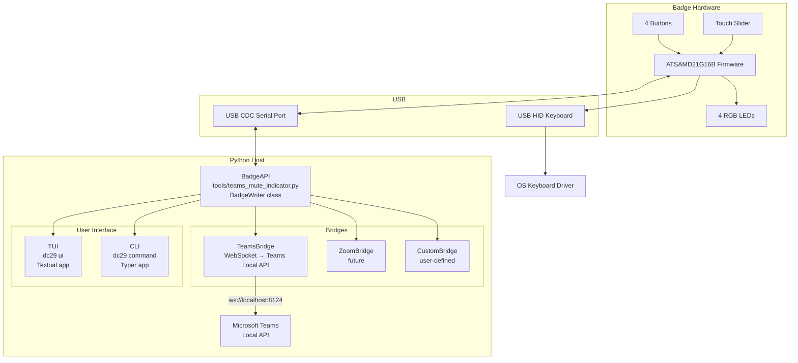

# DC29 Badge — Project Overview

> **docs/spine/** is the authoritative source of truth. These files are written and maintained by humans. Branch docs in `docs/user/`, `docs/developer/`, and `docs/hacker/` are regenerated from this spine — do not hand-edit them.

## What Is This?

The DEF CON 29 (DC29) badge is a conference badge issued to 20,000+ attendees at DEF CON 29. This fork repurposes the badge as a **USB macro keypad with a Microsoft Teams mute-state LED indicator**.

The badge plugs into your computer via USB. It appears as two USB devices simultaneously:

- **USB HID keyboard** — buttons send configurable keystroke macros
- **USB CDC serial port** — a side-channel for status commands and live configuration

The primary use case is the **Teams mute indicator**: LED 4 (bottom-right) shows your Teams meeting state in real time — red when muted, green when unmuted, off when not in a meeting. The state is driven by a Python script that connects to the Teams Local API and writes escape-byte commands to the serial port.

## Hardware Summary

| Component | Detail |
|-----------|--------|
| MCU | ATSAMD21G16B (ARM Cortex-M0+) |
| Flash | 64 KB total, 8 KB reserved for bootloader → 56 KB application |
| RAM | 8 KB |
| Buttons | 4 tactile switches (BUTTON1–BUTTON4) |
| LEDs | 4 RGB LEDs (12 PWM outputs) |
| Slider | Capacitive touch slider (QTouch) |
| Communication | USB HID + USB CDC serial; 6× SERCOM UART for badge-to-badge mesh |
| Power | USB 5V via SW5 power switch |

## Software Architecture



## Quick Start

### Install the Python tooling

```bash
pip install dc29-badge
```

### Connect the badge

Plug the badge into USB. Confirm a serial port appears:

```bash
# macOS
ls /dev/tty.usbmodem*

# Windows
# Check Device Manager → Ports (COM & LPT)
```

### Run the Teams mute indicator

```bash
dc29 teams --port /dev/tty.usbmodem14201
```

On first run, Teams shows an authorization dialog. Click **Allow**. The token is saved to `~/.dc29_teams_token`.

### Or run the TUI

```bash
dc29 ui
```

## Repository Layout

```
Defcon29-mute-button/
├── dc29/                     Python package (dc29-badge)
│   ├── protocol.py           Protocol constants — the ground truth for the escape-byte API
│   ├── tui/                  Textual TUI application
│   └── bridges/              Bridge implementations (Teams, etc.)
├── tools/
│   ├── teams_mute_indicator.py   Standalone Teams bridge script
│   └── TEAMS_MUTE_SETUP.md       Legacy setup guide
├── Firmware/
│   └── Source/DC29/src/      C firmware source
├── Hardware/                  Schematics, BOM, keycap STLs
├── docs/
│   ├── spine/                SOURCE OF TRUTH — never generated
│   ├── user/                 End-user branch — generated from spine
│   ├── developer/            Developer branch — generated from spine
│   └── hacker/               Firmware hacker branch — generated from spine
└── .claude/commands/         Claude Code slash commands
```

## Documentation Map

| Audience | Start Here |
|----------|-----------|
| Just got the badge, want Teams mute indicator | [docs/user/setup.md](../user/setup.md) |
| Python developer extending the tooling | [docs/developer/README.md](../developer/README.md) |
| Want to modify firmware | [docs/hacker/README.md](../hacker/README.md) |
| Full protocol reference | [docs/spine/01-protocol.md](01-protocol.md) |
| Complete architecture reference | [docs/spine/02-architecture.md](02-architecture.md) |
