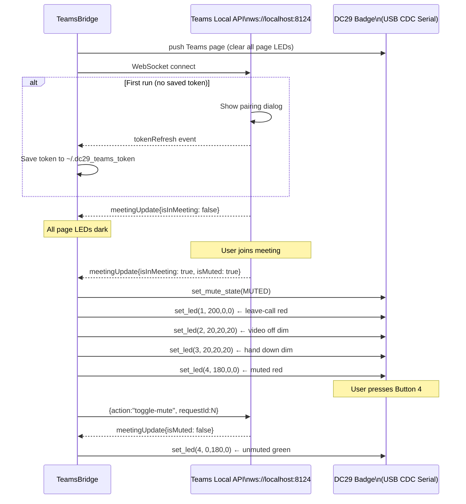

# DC29 Badge — Software Architecture

> **docs/spine/** is the authoritative source of truth.

← Back to [Project Overview](00-overview.md)

## Package Structure

```
dc29-badge Python package
├── dc29/
│   ├── protocol.py        Protocol constants — single source of truth (no I/O)
│   ├── config.py          TOML config (~/.config/dc29/config.toml)
│   ├── badge.py           BadgeAPI — thread-safe serial interface
│   ├── bridges/
│   │   ├── base.py        BaseBridge ABC + BridgePage / PageButton models
│   │   └── teams.py       TeamsBridge — Microsoft Teams Local API
│   ├── tui/
│   │   └── app.py         BadgeTUI — Textual terminal UI
│   └── cli.py             Typer CLI (dc29 entry point)
└── pyproject.toml         pip install dc29-badge
```

---

## BadgeAPI

`dc29.badge.BadgeAPI` is the thread-safe serial interface.  It owns:

- A `serial.Serial` handle (9600 baud) that auto-reopens after any disconnect
- A **reader thread** (daemon) that reads one byte at a time, parses protocol frames, and dispatches events via callbacks
- A **write lock** (`threading.Lock`) so any thread can send commands safely

### Thread Model

```
asyncio event loop (main thread)
├── bridge.run() coroutine — service connection loop
├── bridge._action_sender() — consumes action queue → WebSocket
└── BadgeTUI (optional) — Textual rendering

BadgeAPI reader thread (daemon)
└── _reader_loop() — blocking serial.read(1) → _parse_rx()
    └── _dispatch_rx() → fires individual callbacks
        └── on_state_change(BadgeState) — unified change feed
```

Crossing from the reader thread into the asyncio event loop uses
`loop.call_soon_threadsafe(queue.put_nowait, value)`.

### BadgeState

Every meaningful state change fires `on_state_change(BadgeState)` after the
individual per-event callback.  The TUI subscribes to this single callback
rather than wiring up all seven individual callbacks.

```python
@dataclass
class BadgeState:
    connected:   bool       = False
    effect_mode: int        = 0
    mute_state:  MuteState  = MuteState.NOT_IN_MEETING
    last_button: int | None = None
    last_chord:  int | None = None
    key_map: dict[int, tuple[int, int]] = field(default_factory=dict)
```

### Callbacks

| Callback | Fires when |
|----------|------------|
| `on_button_press(btn, mod, kc)` | Any button pressed |
| `on_key_reply(btn, mod, kc)` | Reply to `CMD_QUERY_KEY` |
| `on_key_ack(btn)` | Badge acknowledges `CMD_SET_KEY` |
| `on_effect_mode(mode)` | Firmware effect mode changed |
| `on_chord(type)` | 4-button chord (1=short, 2=long) |
| `on_connect()` | Serial port opened |
| `on_disconnect()` | Serial port lost |
| `on_state_change(BadgeState)` | Any of the above (unified feed) |

All callbacks are called from the **reader thread**.

---

## Bridge Pages

A **bridge page** is a named set of button behaviors activated by a bridge
while it is connected.  This is the primary extensibility mechanism.

```
Normal operation  →  badge fires EEPROM keymaps for each button
Bridge connected  →  bridge pushes a page:
                       buttons in the page → intercepted, bridge handles them
                       buttons not in page → still fire EEPROM keymaps
Bridge disconnects → page cleared, normal EEPROM operation restored
```

### Data Model

```python
@dataclass
class PageButton:
    label:        str                    # e.g. "toggle-mute"
    led:          tuple[int,int,int]     # static idle color
    led_active:   tuple[int,int,int]     # color when action is "on"
    led_inactive: tuple[int,int,int]     # color when action is "off"

@dataclass
class BridgePage:
    name:        str                     # e.g. "teams"
    description: str
    buttons:     dict[int, PageButton]   # button number → behavior
```

### Default Teams Page

| Button | Action | LED (not in meeting / in meeting) |
|--------|--------|------------------------------------|
| 1 | `leave-call` | dark → red |
| 2 | `toggle-video` | dark → blue (on) / dim (off) |
| 3 | `toggle-hand` | dark → yellow (raised) / dim (lowered) |
| 4 | `toggle-mute` | dark → green (live) / red (muted) |

Configurable via `[teams.buttons]` in `~/.config/dc29/config.toml`.

---

## BaseBridge

All bridges subclass `dc29.bridges.base.BaseBridge`.

```python
class BaseBridge(ABC):
    @property
    @abstractmethod
    def page(self) -> BridgePage: ...

    @abstractmethod
    async def run(self) -> None: ...

    async def handle_button(self, btn: int) -> None: ...

    # Lifecycle helpers (call from subclass):
    def _install_button_hook(self) -> None: ...
    def _uninstall_button_hook(self) -> None: ...
    def _apply_page_leds(self) -> None: ...
    def _clear_page_leds(self) -> None: ...
```

`_install_button_hook()` wraps `badge.on_button_press` to intercept only the
buttons listed in `self.page.buttons`; unowned buttons still fire normally.

---

## TeamsBridge

`dc29.bridges.teams.TeamsBridge` extends `BaseBridge`.

### Connection Flow



### Action Dispatch

Buttons in the page call `handle_button(btn)` → enqueue action string →
`_action_sender()` coroutine dequeues → sends `{action: <ws-action>}` to
Teams WebSocket.

Valid Teams API actions: `toggle-mute`, `toggle-video`, `toggle-hand`,
`toggle-background-blur`, `leave-call`.

---

## Config

`dc29.config.Config` loads `~/.config/dc29/config.toml`.  All sections are
optional; defaults are applied when a key is absent.

```toml
[badge]
port       = "/dev/tty.usbmodem14201"
brightness = 0.8

[teams]
toggle_hotkey = "<ctrl>+<alt>+m"
[teams.buttons]
1 = "leave-call"
2 = "toggle-video"
3 = "toggle-hand"
4 = "toggle-mute"

[slack.buttons]
1 = "leave-call"
2 = "toggle-video"
3 = "raise-hand"
4 = "toggle-mute"
```

`get_config()` returns a module-level singleton.  The CLI always calls
`get_config()` and merges CLI flags on top of config values.

---

## CLI Architecture

Entry point: `dc29.cli:app` (Typer).

```
dc29 ui                  → BadgeTUI(BadgeAPI(port)).run()
dc29 teams               → TeamsBridge.run() — full page mode
dc29 set-key BUTTON MOD  → BadgeAPI.set_key()
dc29 get-key BUTTON      → BadgeAPI.query_key() + wait for EVT_KEY_REPLY
dc29 set-led N R G B     → BadgeAPI.set_led()
dc29 set-effect MODE     → BadgeAPI.set_effect_mode()
dc29 info                → query all 4 buttons, Rich table
dc29 monitor             → stream all badge events to stdout
dc29 config show         → print effective config as TOML
dc29 config init         → write default config to disk
dc29 autostart install   → launchd / systemd / Task Scheduler service
dc29 autostart remove    → remove service
```

---

## TUI Architecture

`dc29.tui.BadgeTUI` is a Textual `App` subclass.

5 tabs: **Dashboard** (live status) · **Keys** (EEPROM keymap editor) ·
**LEDs** (live LED color picker) · **Effects** (firmware effect mode) ·
**Log** (event stream).

Badge callbacks → `loop.call_soon_threadsafe(self.post_message, ...)` →
Textual message system → reactive widget updates.

---

## Extension: Adding a New Bridge

1. Create `dc29/bridges/myservice.py`
2. Subclass `BaseBridge`
3. Implement `page` property (define which buttons you claim)
4. Implement `run()` (connect to your service, call `_install_button_hook()`)
5. Override `handle_button(btn)` to dispatch service actions
6. Add a `dc29 myservice` CLI subcommand

See `dc29/bridges/teams.py` as the reference implementation.
